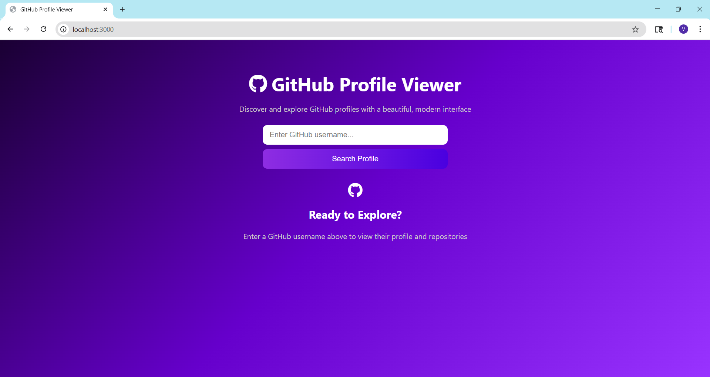

# 🐙 GitHub Profile Viewer

A beautiful and modern interface to explore GitHub user profiles and repositories using the GitHub API.

## ✨ Features

- View GitHub user profiles with avatars, bio, stats, and links
- Search by username
- Display recent repositories with stars and forks
- Responsive and elegant design

## 🖼 Preview




## 📦 Technologies Used

- Node.js
- Express.js
- EJS (Embedded JavaScript Templates)
- GitHub REST API
- HTML/CSS

## 🔧 How to Run Locally

```bash
git clone https://github.com/YOUR_USERNAME/github-profile-viewer.git
cd github-profile-viewer
npm install
nodemon app.js
